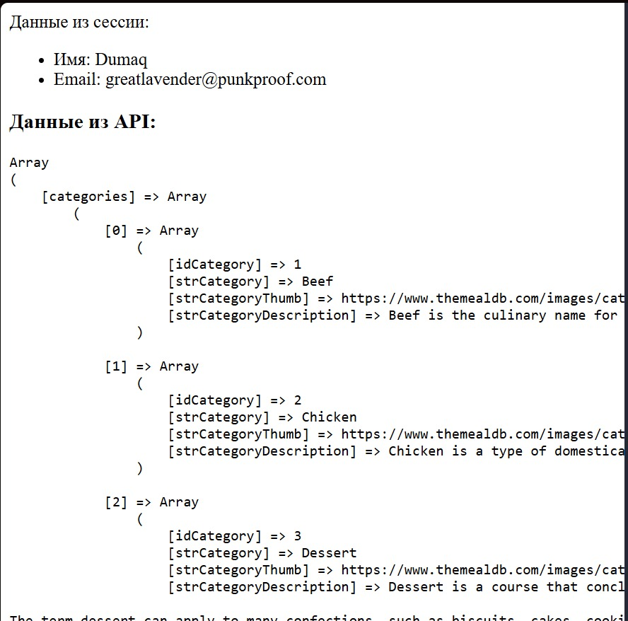
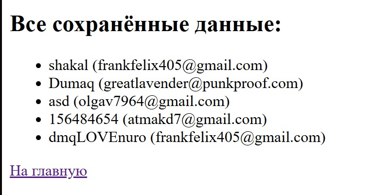

# Лабораторная работа №3: Обработка данных выполняется на сервере через PHP.  

## 👩‍💻 Автор
ФИО: Атмакин Дмитрий Михайлович     
Группа: 3МО-1

---

## 📌 Описание заданий  

1. - [x] Научиться обрабатывать данные формы на стороне сервера с помощью PHP. 
2. - [x] Сохранять данные формы в сессии.  
3. - [x] Сохранять данные в файл и выводить их обратно на странице.   
4. - [x] Научиться выводить все сохранённые данные в отдельной странице.   
5. - [x] Научиться изменять существующую форму, чтобы отключить JS-обработку (кроме alert) и использовать PHP. 

---

## ⚙️ Как запустить проект

1. Клонировать репозиторий:
   ```bash
   git clone https://github.com/Dumaqkumaq/Docker-start
   cd Docker-start-main
Запустить контейнеры:
```bash
docker-compose up -d --build
```
Открыть в браузере:  
```http://localhost:8080``` для главной страницы.  
```http://localhost:8080/view.php``` для просмотра списка заполненных форм. 

>[!WARNING]  
>У data.txt должно быть право на редактирование\запись. Самый простой способ проверить права в Ubuntu: ```ls -la code/data.txt ```. Если не видно ```-rw-rw-rw-```, то советую прописать ```chmod 666 code/data.txt```.  

📂 Содержимое проекта   
.  
├── ```code```/   
│   ├── ```data.txt``` - txt-файл для хранения записей   
│   ├── ```form.html``` - форма для заполнения на HTML\JS   
│   └── ```index.php``` - дополнительная тестовая PHP-страница   
│   ├── ```index.html``` - дополнительная тестовая HTML-страница   
│   ├── ```process.php``` - обработка полученных данных на сервере   
│   └──```view.php``` - PHP-страница для вывода заполненных форм   
├── ```nginx```  -  конфигурация Nginx    
├── ```docker-compose.yml``` - описание сервиса Nginx    
└── ```screenshots``` - все скриншоты  


📸 Скриншоты работы  

    
  
  

✅ Результат    
Обработка данных на сервере через PHP успешно добавлена и проверена на работоспособность.