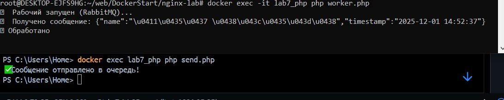

# Лабораторная работа №7: Асинхронная обработка данных через очереди сообщений (RabbitMQ / Kafka)
  

## 👩‍💻 Автор
ФИО: Атмакин Дмитрий Михайлович     
Группа: 3МО-1

---

## 📌 Описание заданий  

1. - [x] - Научиться работать с очередями сообщений и реализовывать асинхронную обработку данных в PHP.     
2. - [x] - Познакомиться с интеграцией брокеров сообщений RabbitMQ и Apache Kafka через Docker.         
3. - [x] - Научиться создавать producers (отправители) и consumers (обработчики) задач.       

---

## ⚙️ Как запустить проект

1. Клонировать репозиторий:
   ```bash  
   git clone https://github.com/Dumaqkumaq/Docker-start  
   cd Docker-start-main 
2. Установить [Docker](https://github.com/docker)   

Запустить контейнеры:
```bash  
docker-compose up -d --build
```   

📂 Содержимое проекта   
.  
├── ```code```/    
│   ├── ```index.php``` - вывод результата   
│   ├── ```QueueManager.php``` - обработка очереди     
│   ├── ```send.php``` - создание очереди     
│   ├── ```worker.php``` - работа с очередью   
│   └── ```vendor```/  - папка с библиотеками (чтобы код видел их)      
├── ```nginx```/   - папка для настройки nginx
├── ```vendor```/  - папка с библиотеками    
├── ```composer.json```/   - настройки доп библиотек для docker   
├── ```docker-compose.yml``` - описание сервиса  
└── ```screenshots``` - все скриншоты  

📸 Скриншоты работы  
    

  

✅ Результат    
RabbitMQ освоен! Добавлен веб интерфейс и обработка ошибок с помощью очереди. 